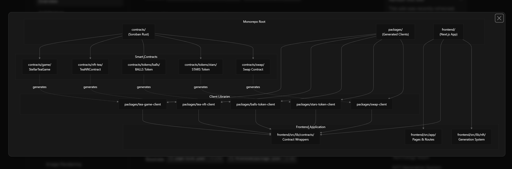

# **Stellar Tea — Play-to-Earn Tea Blending Game on Stellar Blockchain**

## **Executive Summary**

**Stellar Tea** is a blockchain-based play-to-earn game built on the Stellar network using Soroban smart contracts.
It combines collaborative NFT crafting, dual-token economy, and gamified progression mechanics to create a social gaming experience where players mint tea NFTs, blend them into rare collectibles, and trade on an integrated marketplace.

---

## **Project Overview**

Stellar Tea orchestrates every asset, reward, and liquidity event through audited Soroban smart contracts, while a production-grade Next.js frontend delivers instant wallet connectivity, deterministic NFT rendering, and collaborative game flows.

The platform converts cooperative NFT crafting into monetizable network effects where players:

* Mint flavor-forward tea NFTs
* Fuse them into rarity-defining collectibles
* Accelerate progression through dual-token sinks
* Trade on a fee-engineered marketplace that compounds treasury growth and burns supply in real-time

---

## **Architecture**

### **Smart Contract Suite**

The project consists of five main Soroban smart contracts organized in a workspace structure:

---

### **1. StellarTeaGame Contract (`contracts/game`)**

The core game contract orchestrating all gameplay mechanics and maintaining a schema-driven catalog of recipes.

#### **Key Modules**

* **Mixing System:** Handles collaborative tea blending offers and execution
* **Marketplace:** Manages NFT listings and sales with fee structure
* **Rewards:** Daily claims and event-based reward distribution
* **Limits:** Rate limiting for daily actions and emissions
* **Configuration:** Recipe and game parameter management

#### **Economic Parameters**

* Market Fee: **3%** on all marketplace transactions
* Burn Rate: **2%** of marketplace fees are burned
* Daily Rewards: **0.02 BALLS** and **0.002 STARS** per claim
* Loser Compensation: **80%** of losing party’s fee returned in mixing

---

### **2. TeaNftContract (`contracts/nft-tea`)**

An enumerable and burnable NFT collection with rich metadata for tea characteristics.

#### **Features**

* Immutable provenance with lineage tracking
* Role-based admin/operator governance model
* Sequential minting for predictable token IDs
* Metadata includes: name, flavor profile, rarity, level, stats, lineage, image URI

---

### **3. Fungible Tokens**

#### **BALLS (Bubbles)**

* Utility token with 8 decimals
* Initial supply: **100,000,000,000** tokens
* Used for daily actions, mixing, upgrades, and marketplace trades
* Deflationary through burn mechanisms across gameplay

#### **STARS**

* Premium token with 8 decimals
* Initial supply: **10,000,000,000** tokens
* Powers high-rarity mixes, premium listings, and event stakes
* Convertible to XLM via swap contract

---

### **4. Swap Contract (`contracts/swap`)**

Provides XLM-to-STARS conversion with programmable treasury routing.

#### **Functionality**

* Accepts authenticated XLM deposits
* Transfers XLM to treasury-managed address
* Mints STARS tokens for recipients
* Configurable admin controls

---

### **Contract Dependencies**

All contracts use **OpenZeppelin Stellar** libraries for secure token implementations.

---
Architecture Diagram:


---


## **Game Mechanics**

### **1. Tea Minting**

Players mint new tea NFTs by:

1. Paying **150 STARS** to the tea contract
2. Browser generates unique tea with random layers and flavor profiles
3. Image and metadata uploaded to IPFS (Filebase)
4. On-chain NFT minted with metadata reference

---

### **2. Tea Mixing (Fusion)**

The core social gameplay mechanic where two players collaborate to create a new, upgraded tea.

#### **Workflow**

1. **Create Mix Offer** — Player A locks their tea NFT and specifies:

   * Desired flavor profile for partner’s tea
   * Minimum rank requirement
   * Recipe to create
   * Token fees (BALLS/STARS)

2. **Accept Offer** — Player B locks their tea NFT with matching fees

3. **Execute Mix** — Contract automatically:

   * Burns both input NFTs
   * Determines winner/loser randomly
   * Mints new fusion tea with recorded lineage
   * Distributes fees (winner keeps proceeds, loser gets 80%, 20% to treasury)
   * Updates metadata with parent lineage

---

### **3. Tea Upgrades**

Players can level up existing tea NFTs:

* Consume STARS/BALLS tokens
* Increase level by 1
* 50% burned, 50% sent to treasury
* Metadata updated

---

### **4. Marketplace**

Custodial marketplace for trading tea NFTs.

#### **Features**

* List NFTs priced in BALLS or STARS
* Automatic escrow handling
* 3% protocol fee on sales
* 2% burned, 1% to treasury
* Instant fulfillment

---

### **5. Daily Rewards**

Retention mechanic with rate-limited claiming:

* Players claim daily rewards of **0.02 BALLS + 0.002 STARS**
* Enforced through ledger-backed rate limits

---

### **6. Event Staking**

Seasonal engagement mechanic:

* Organizer-led staking pools
* 10% burned automatically
* Remaining 90% distributed among participants

---

## **Tokenomics**

### **Dual-Token Model**

#### **BALLS (Utility Token)**

* Total Supply: **100,000,000,000**
* Used for daily gameplay, basic mixing, and marketplace
* Deflationary via burns from mixing, upgrades, and trades
* Earned through gameplay

#### **STARS (Premium Token)**

* Total Supply: **10,000,000,000**
* Used for premium actions and minting
* Convertible from XLM via swap
* Deflationary through burn mechanisms

---

### **Economic Flows**

#### **Sources (Token Generation)**

* Daily claims
* Initial treasury allocations
* STARS minting via XLM swap

#### **Sinks (Token Burning)**

* 50% of upgrade costs
* 2% of marketplace sales
* Mixing fees
* 10% of event stakes

#### **Treasury Revenue**

* 50% of upgrade costs
* 1% of marketplace sales
* 20% of mixing fees
* 90% of event stakes

---

## **Frontend Application**

### **Technology Stack**

* **Framework:** Next.js 16.0.1 + React 19
* **Wallet Integration:** Creit.tech Stellar Wallets Kit
* **Blockchain SDK:** Stellar SDK 14.3.1
* **UI:** Radix UI + Tailwind CSS
* **Testing:** Vitest

---

### **Key Features**

#### **Generative NFT System**

* Browser-side PNG layer compositing
* IPFS uploads via Filebase
* 50 flavor palettes with tasting notes
* Deterministic metadata generation

#### **Fusion Orchestration**

* Allowance checks and token transfers
* Contract invocation coordination
* Stat and color blending simulation
* Lineage tracking

#### **Auto-generated Contract Clients**

* TypeScript clients for all contracts
* Type-safe contract interactions
* Hot reload for changes

---

### **Application Structure**

```
src/
├── app/           # Next.js pages (mint, marketplace, swap, profile, generate)
├── components/    # UI components
├── lib/
│   ├── nft/       # NFT generation & fusion logic
│   ├── contracts/ # Contract helpers
│   ├── ipfs/      # IPFS client
│   └── hooks/     # Custom React hooks
```

---

## **Installation & Setup**

### **Prerequisites**

* Rust & Cargo
* Soroban compilation target (`wasm32-unknown-unknown`)
* Node.js ≥ 22
* pnpm
* Stellar CLI
* Scaffold Stellar CLI Plugin

---

### **Quick Start**

#### 1. Clone and Initialize

```bash
git clone https://github.com/foundermafstat/stellar-tea.git
cd stellar-tea
```

#### 2. Configure Environment

```bash
cp .env.example .env
cd frontend
cp .env.local.example .env.local
```

**Frontend Variables:**

```env
NEXT_PUBLIC_IPFS_API_KEY=<Your Filebase API key>
NEXT_PUBLIC_IPFS_API_ENDPOINT=https://ipfs.filebase.io/api/v1
NEXT_PUBLIC_IPFS_GATEWAY_URL=https://ipfs.filebase.io
```

#### 3. Install Dependencies

```bash
npm install
```

#### 4. Configure Network

Edit `environments.toml` for development/testnet/mainnet setup.

#### 5. Start Development

```bash
npm run dev
```

App runs at `http://localhost:3000`.

---

### **Contract Deployment**

#### Local Development

Contracts auto-deploy when running `npm run dev`.

#### Testnet/Mainnet

```bash
stellar registry publish

stellar registry deploy \
  --deployed-name stellar-tea-game \
  --published-name stellar-tea-game \
  -- --admin <ADMIN_ADDRESS>

stellar registry create-alias stellar-tea-game
```

---

### **Project Structure**

```
stellar-tea/
├── contracts/
│   ├── game/
│   ├── nft-tea/
│   ├── tokens/
│   │   ├── balls/
│   │   └── stars/
│   └── swap/
├── frontend/
│   └── src/
│       ├── app/
│       ├── components/
│       ├── lib/
│       └── hooks/
├── packages/
├── Cargo.toml
├── environments.toml
└── README.md
```

---

## **Security & Governance**

### **Role-Based Access Control**

* **Admin:** Full control, sets operators
* **Operator:** Mint NFTs, update metadata
* **Players:** Interact via authenticated actions

### **Economic Safeguards**

* **Rate Limiting:** Prevents spam and inflation
* **Treasury Thresholds:** Caps on daily emissions
* **Atomic Transactions:** Rollback-safe cross-contract calls

### **Observability**

* Real-time dashboards
* Anomaly detection
* Revenue attribution
* Retention modeling

---

## **Testing**

### **Contract Tests**

```bash
cargo test
```

### **Frontend Tests**

```bash
cd frontend
npm test
```

Tests cover color blending, lineage math, and metadata helpers.

---

## **Development Commands**

```bash
npm run dev       # Start dev server
npm run build     # Production build
npm run start     # Start production server
npm run lint      # Run ESLint
npm test          # Run tests
```

---

## **License**

This project is licensed under the **Apache License 2.0**.

---

## **Built With**

* **Soroban SDK** – Smart contract development
* **OpenZeppelin Stellar Contracts** – Secure token implementations
* **Scaffold Stellar** – Development framework
* **Next.js** – React framework
* **Stellar Network** – Blockchain platform
